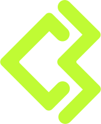

<div style="display:flex; flex-direction:column; justify-content:center; align-items:center;">

<h1>CryptoWallet</h1>
</div>
<hr>

## Descrizione 📝

<p>
CryptoWallet è una web App con focus sul front-end ed incentrata sul mondo delle cryptovalute. Sfruttando l'API di <a href="https://www.coingecko.com/en/api/documentation" target="_blank">Coingecko</a>, l'utente sarà in grado di accedere a diverse funzionalità tra cui:

- funzione Login e Signup;
- visualizzazione dei trending del giorno;
- sezione Trade in cui poter acquistare e/o aggiungere ai preferiti i coin scelti dall'utente stesso;
- sezione Wallet in cui l'utente potrà controllare l'andamento del proprio Balance e l'andamento dei coin acquistati;
- sezione Watchlist, presente in Homepage, in cui l'utente potrà osservare i coin aggiunti alla lista dei preferiti.

Inoltre, grazie all'utilizzo di una seconda API (<a href="https://docs.nftport.xyz/" target="_blank">NFTPort</a>) scelta dal team, l'utente potrà accedere a una sezione NFT in cui è presente una galleria di "Bored Ape Yacht Club". Ogni card sarà poi cliccabile per accedere alla descrizione dettagliata del singolo NFT.

Grazie all'uso di hooks come useReducer e useContext, è stato possibile gestire la comunicazione tra vari componenti e pagine. Soprattutto gestire la complessità che portava l'interazione dell'utente con il carrello.

Una prossima possibile implentazione sarà quella di ampliare la sezione NFT e concretizzare questa web App come un social network per i trader e collezionisti di NFT.

</p>
</br>
<h2 style="text-align: left"> Tecnologie 🚀</h2>

<ul style="display: flex; flex-direction: row; gap:20px; align-items: center; justify-content: flex-start;">


</ul>

<hr>

</br>

## Istruzioni 👾

Avvia il server:

```bash
npm run dev
# or
yarn dev
# or
pnpm dev
```

Installa i node_modules:

```bash
npm install
```

   <p><b>Effettua il login o registrati</b></p>
    <ul>
    <li><b>user</b>: marcoriv | <b>pass</b>: coding</li>
    <li><b>user</b>: magichiara | <b>pass</b>: coding</li>
    <li><b>user</b>: cesare28 | <b>pass</b>: coding</li>
    <li><b>user</b>: pietro23 | <b>pass</b>: coding</li>
    <li><b>user</b>: sebastiano28 | <b>pass</b>: coding</li>
    </ul>

</div>
<hr>

</br>

## Il Team 👩🏻‍💻👨🏻‍💻

<p>
Il progetto finale del coding bootcamp 5 di Edgemony è stato svolto in gruppo, con la partecipazione degli studenti in elenco. Il progetto è stato completato in due settimane e seguendo la metodologia Agile, nello specifico Scrum. Durante gli sprint giornalieri, il team ha avuto modo di monitorare il progresso del lavoro e identificare eventuali ostacoli fino al completamento del progetto. Questo approccio organizzativo ha favorito il completamento dei singoli task ed infine il completamento del progetto.

<ul style=" display: flex; flex-direction: column;  align-items: flex-start; list-style-type: none; padding: 0px; text-align: center;">
        <li>Cesare Tomasello:  <a href="https://www.linkedin.com/in/cesare-tomasello"  target="_blank">LinkedIn</a> |  <a href="https://github.com/Cesare-Tomasello"  target="_blank">GitHub</a></li>
        <li>Chiara Maggio:  <a href="https://www.linkedin.com/in/chiaramaggio"  target="_blank">LinkedIn</a> |  <a href="https://github.com/magichiara"  target="_blank">GitHub</a></li>
        <li>Marco Rivera:  <a href="https://www.linkedin.com/in/marcorivera92/"  target="_blank">LinkedIn</a> |  <a href="https://github.com/marcorivera92"  target="_blank">GitHub</a></li>
        <li>Pietro Di Stefano:  <a href="https://www.linkedin.com/in/pietro-di-stefano-a92475222"  target="_blank">LinkedIn</a> |  <a href="https://github.com/pietrodistefano23"  target="_blank">GitHub</a></li>
       <li>Sebastiano Occhipinti:  <a href="https://www.linkedin.com/in/sebastianoocchipinti25/"  target="_blank">LinkedIn</a> |  <a href="https://github.com/theBoneless25"  target="_blank">GitHub</a></li>
      </ul>
</p>
